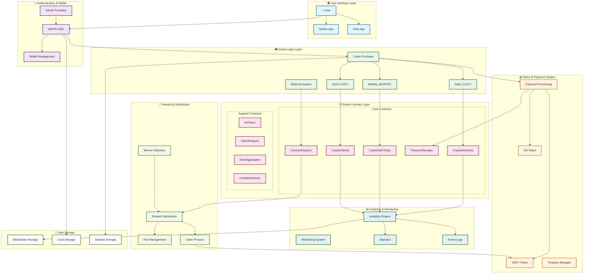
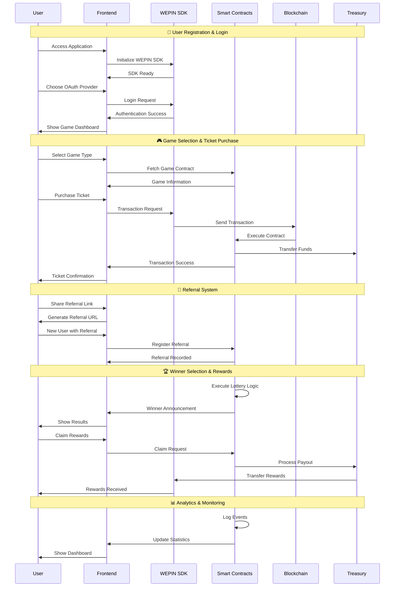

# ETH LOTTERY - Smart Contract Lottery System

A comprehensive smart contract lottery system built with Foundry and React, featuring multiple lottery types and referral systems.

## 🚀 Project Overview

This project consists of two main components:
- **Smart Contracts**: Solidity contracts for lottery management, treasury, and referral systems
- **Frontend**: React-based web application for lottery interaction

## 🏗️ Project Structure

```
Eth-Lottery/
├── contracts/          # Smart contract source code
├── script/            # Foundry deployment scripts
├── test/              # Smart contract tests
├── frontend/          # React web application
├── lib/               # Foundry dependencies
└── docs/              # Project documentation
```

## 🔄 **Complete System Flow Diagram**



## 🔄 **Detailed User Journey Flow**



## 🏗️ **System Architecture Components**

### **Frontend Layer** (`frontend/`)
- **React + TypeScript**: Modern web application framework
- **Tailwind CSS**: Utility-first CSS framework
- **WEPIN SDK Integration**: Blockchain wallet functionality
- **Responsive Design**: Mobile-first approach

### **Smart Contract Layer** (`contracts/`)
- **47 Total Contracts**: Comprehensive blockchain infrastructure
- **Modular Architecture**: Organized by functionality
- **Security Features**: Access control, circuit breakers, rate limiting
- **Upgradeable Design**: UUPS proxy pattern support

### **Blockchain Integration**
- **VeryNetwork**: Chain ID 4613
- **Ethereum Compatibility**: Solidity smart contracts
- **Gas Optimization**: Efficient transaction processing
- **Event Logging**: Comprehensive audit trail

### **Authentication & Security**
- **Multi-Provider OAuth**: Google, Apple, Discord, Naver, Facebook, Line, Kakao
- **Wallet Management**: WEPIN SDK integration
- **Session Persistence**: Local storage management
- **Access Control**: Role-based permissions

### **Game Logic & Economics**
- **Multiple Lottery Types**: Daily, Weekly, Advertisement-based
- **Token System**: VERY and AD tokens
- **Referral Rewards**: Multi-level referral system
- **Fee Management**: 10% fee structure

### **Data & Analytics**
- **Real-time Statistics**: Live game data
- **Performance Monitoring**: Gas usage, transaction success rates
- **User Analytics**: Player behavior tracking
- **Event Logging**: Comprehensive audit trail

## 🔧 Smart Contracts

### Core Contracts
- **Cryptolotto1Day**: Daily lottery system
- **Cryptolotto7Days**: Weekly jackpot system  
- **CryptolottoAd**: Advertisement-based lottery
- **TreasuryManager**: Treasury management system
- **CryptolottoReferral**: Referral and reward system

### Features
- Multiple lottery types (Daily, Weekly, Ads)
- Referral system with rewards
- Treasury management
- Circuit breaker functionality
- Comprehensive testing suite

## 🎯 Frontend Application

### Features
- **WEPIN Wallet Integration**: Blockchain wallet functionality
- **VeryNetwork Support**: Chain ID 4613 blockchain interaction
- **Social Login**: Google, Apple, Discord, Naver, Facebook, Line, Kakao
- **VERY Token System**: Prize management and participant tracking
- **Multi-language Support**: Korean, English, Japanese
- **Responsive Design**: Mobile-optimized UI

### Technology Stack
- **Frontend**: React + TypeScript
- **Styling**: Tailwind CSS
- **Wallet**: WEPIN SDK
- **Blockchain**: VeryNetwork (Chain ID: 4613)
- **Build Tool**: Vite

## 📋 Installation & Setup

### Prerequisites
- Node.js 18.x or higher
- Foundry (for smart contract development)
- Git

### 1. Clone the Repository
```bash
git clone <repository-url>
cd Eth-Lottery
```

### 2. Smart Contract Setup
```bash
# Install Foundry dependencies
forge install

# Build contracts
forge build

# Run tests
forge test
```

### 3. Frontend Setup
```bash
cd frontend

# Install dependencies
npm install

# Set up environment variables
cp .env.example .env
# Edit .env with your configuration

# Start development server
npm run dev
```

### 4. Environment Variables
Create a `.env` file in the frontend directory:

```env
# WEPIN Configuration
VITE_WEPIN_APP_KEY=your-wepin-app-key

# Network Configuration
VITE_RPC_URL=https://rpc.verylabs.io
VITE_EXPLORER_URL=https://veryscan.io

# Contract Addresses (NEW WORKING CONTRACTS!)
VITE_CONTRACT_CRYPTOLOTTO_1DAY=your-cryptolotto-1day-contract-address
VITE_CONTRACT_CRYPTOLOTTO_7DAYS=your-cryptolotto-7days-contract-address
VITE_CONTRACT_CRYPTOLOTTO_AD=your-cryptolotto-ad-contract-address

# Core Contract Addresses (from previous deployment)
VITE_CONTRACT_TREASURY_MANAGER=your-treasury-manager-contract-address
VITE_CONTRACT_REGISTRY=your-registry-contract-address
VITE_CONTRACT_STATS_AGGREGATOR=your-stats-aggregator-contract-address
VITE_CONTRACT_FUNDS_DISTRIBUTOR=your-funds-distributor-contract-address
VITE_CONTRACT_CRYPTOLOTTO_REFERRAL=your-cryptolotto-referral-contract-address
VITE_CONTRACT_AD_TOKEN=your-ad-token-contract-address
VITE_CONTRACT_OWNABLE=your-ownable-contract-address

# Deployer Address
VITE_DEPLOYER_ADDRESS=your-deployer-address
```

## 🏃‍♂️ Running the Project

### Smart Contracts
```bash
# Run all tests
forge test

# Run specific test suites
forge test --match-contract Cryptolotto -vv
forge test --match-contract CryptolottoIntegration -vv
forge test --match-contract CryptolottoSecurity -vv

# Generate coverage report
forge coverage --report lcov

# Build contracts
forge build
```

### Frontend
```bash
cd frontend

# Development server
npm run dev

# Build for production
npm run build

# Preview production build
npm run preview
```

## 🌐 VeryNetwork Configuration

- **Chain ID**: 4613
- **Network Name**: VeryNetwork
- **Provider ID**: `verynetwork`
- **RPC URL**: https://rpc.verylabs.io
- **Explorer**: https://veryscan.io

## 🧪 Testing

### Smart Contract Tests
```bash
# Run all tests
forge test

# Run with verbose output
forge test -vv

# Run specific test file
forge test --match-path test/Cryptolotto.t.sol

# Run fuzzing tests
forge test --match-contract CryptolottoFuzz -vv
```

### Frontend Tests
```bash
cd frontend
npm test
```

## 📚 Documentation

- **Smart Contracts**: See `contracts/` directory for detailed contract documentation
- **Deployment**: Check `script/` directory for deployment scripts
- **Testing**: Review `test/` directory for comprehensive test coverage
- **CI/CD**: GitHub Actions workflow for automated testing and building

## 🚀 Deployment

### Smart Contracts
```bash
# Deploy to Verychain
forge script script/Deploy.s.sol --rpc-url https://rpc.verylabs.io --broadcast
```

### Frontend
```bash
cd frontend
npm run build
# Deploy dist/ folder to your hosting service
```

## ⚠️ Important Notes

- Environment variables must be properly configured
- WEPIN Workspace app registration required
- Designed specifically for VeryNetwork
- Secure private key management for deployment
- Comprehensive testing recommended before production

## 🐛 Troubleshooting

### Smart Contract Issues
- Check Foundry installation: `foundryup`
- Verify dependencies: `forge install`
- Review test output for specific errors

### Frontend Issues
- Verify environment variables
- Check WEPIN app registration status
- Ensure VeryNetwork provider is available
- Review browser console for errors

### Build Issues
- Verify Node.js version (18.x+ recommended)
- Clear cache: `rm -rf node_modules && npm install`
- Check Foundry version: `forge --version`

## 📄 License

This project is licensed under the MIT License.

## 🤝 Contributing

1. Fork the repository
2. Create a feature branch
3. Make your changes
4. Add tests for new functionality
5. Ensure all tests pass
6. Submit a pull request

## 📞 Support

For issues and questions:
- Check existing documentation
- Review test files for examples
- Open an issue on GitHub
- Check CI/CD logs for build issues 