```mermaid
sequenceDiagram
    participant U as User
    participant F as Frontend
    participant W as WEPIN SDK
    participant SC as Smart Contracts
    participant BC as Blockchain
    participant T as Treasury

    Note over U,T: 🚀 User Registration & Login
    U->>F: Access Application
    F->>W: Initialize WEPIN SDK
    W->>F: SDK Ready
    U->>F: Choose OAuth Provider
    F->>W: Login Request
    W->>F: Authentication Success
    F->>U: Show Game Dashboard

    Note over U,T: 🎮 Game Selection & Ticket Purchase
    U->>F: Select Game Type
    F->>SC: Fetch Game Contract
    SC->>F: Game Information
    U->>F: Purchase Ticket
    F->>W: Transaction Request
    W->>BC: Send Transaction
    BC->>SC: Execute Contract
    SC->>T: Transfer Funds
    SC->>F: Transaction Success
    F->>U: Ticket Confirmation

    Note over U,T: 🔗 Referral System
    U->>F: Share Referral Link
    F->>U: Generate Referral URL
    U->>F: New User with Referral
    F->>SC: Register Referral
    SC->>F: Referral Recorded

    Note over U,T: 🏆 Winner Selection & Rewards
    SC->>SC: Execute raffle Logic
    SC->>F: Winner Announcement
    F->>U: Show Results
    U->>F: Claim Rewards
    F->>SC: Claim Request
    SC->>T: Process Payout
    T->>W: Transfer Rewards
    W->>U: Rewards Received

    Note over U,T: 📊 Analytics & Monitoring
    SC->>SC: Log Events
    SC->>F: Update Statistics
    F->>U: Show Dashboard
```

# Very Lucky - Smart Contract Raffle System

A comprehensive smart contract raffle system built with Foundry and React, featuring multiple raffle types and referral systems, powered by VeryChain.

## 📋 Table of Contents

- [프로젝트 개요](#-프로젝트-개요)
- [게임 목록](#-게임-목록)
- [게임 방법](#-게임-방법)
- [주요 기능](#-주요-기능)
- [Project Structure](#️-project-structure)
- [System Architecture Components](#️-system-architecture-components)
- [Complete System Flow Diagram](#️-complete-system-flow-diagram)
- [Detailed User Journey Flow](#️-detailed-user-journey-flow)
- [Smart Contracts](#-smart-contracts)
- [Frontend Application](#-frontend-application)
- [설치 방법](#설치-방법)
- [Running the Project](#️-running-the-project)
- [VeryNetwork Configuration](#️-verynetwork-configuration)
- [Testing](#️-testing)
- [Documentation](#-documentation)
- [Important Notes](#️-important-notes)
- [Troubleshooting](#️-troubleshooting)
- [License](#-license)
- [기여자](#️-기여자)
- [Support](#-support)


## 🇰🇷 프로젝트 개요

VeryLucky는 VeryChain DApp(탈중앙화 애플리케이션)으로 구동되는 추첨 시스템입니다. 백엔드 코드는 탈중앙화된 피어투피어 네트워크에서 실행되며, 스마트 컨트랙트와 프론트엔드로 구성되어 있습니다. VeryLucky는 자율적으로 작동하며 핵심 기능을 제어하는 개체가 없습니다. VeryLucky의 데이터와 운영 기록은 공개된 탈중앙화 Very 블록체인 네트워크에 암호화되어 저장됩니다.

VeryLucky의 주요 아이디어는 간단합니다: 전 세계 사람들이 정해진 시간 동안 하나의 지갑에 동일한 금액의 VERY를 기여합니다. 타이머가 끝나면 이 스마트 컨트랙트 기반 지갑이 자동으로 받은 모든 VERY를 무작위로 선택된 한 명의 지갑 참가자에게 보냅니다.

## 🎮 게임 목록

| 게임명 | 지속시간 | 가격 | 컨트랙트 주소 |
|--------|----------|------|----------------|
| Daily Lucky | 1일 | 0.01 VERY | 0x118f17f1c67bc53e6341de3f9b6112abf81505f0 |
| Weekly Lucky | 7일 | 1 VERY | 0x106302aa07955306c31b8e916a16500482016ec2 |
| ADS Lucky | 1일 | 1 AD | 0x51f37f32cd84908f58eb2c5b7e141b61d5774f0a |

## 🎯 게임 방법

YouTube의 설명 영상을 시청해 주세요. 모든 질문에 답변이 될 것입니다.

1. **Wepin 지갑 사용**: 게임을 시작하려면 Google ID 가 필요합니다.
게임을 시작하기 전에 지갑에 충분한 VERY를 충전하세요.

2. **게임 선택**: 3개의 게임이 동시에 실행됩니다. 각 게임은 다른 지속시간과 입장 비용을 가집니다. 같은 게임에 여러 번 참여할 수 있으며, 모든 게임에 동시에 참여할 수도 있습니다.

3. **지갑 주소 복사**: 올바른 지갑 주소로 자금을 보내는지 확인하세요. 각 게임은 홈페이지와 공식 GitHub 페이지에 표시되는 고유한 주소를 가집니다.

4. **자금 전송**: 각 게임은 고유한 가격을 가집니다. 게임에 참여하려면 주어진 주소로 정확한 금액의 VERY를 보내야 합니다. 모든 것이 올바르다면 플레이어 목록에서 지갑 주소를 찾을 수 있습니다.

5. **결과 대기**: 잭팟 당첨자에 대한 알림을 받으려면 텔레그램 채널에 참여하세요. 당첨자가 되면 게임이 끝난 직후 모든 잭팟 금액을 지갑으로 즉시 받게 됩니다.

## ✨ 주요 기능

- **안전한 게임**: 다른 플레이어가 없어도 안전하게 게임에 참여할 수 있습니다. 게임이 끝날 때까지 다른 사람이 참여하지 않으면 VERY을 자동으로 지갑으로 돌려받습니다.

- **즉시 결과**: Verychat에 참여하여 휴대폰으로 즉시 알림을 받으세요.

- **전 세계 이용 가능**: 전 세계 모든 사람이 Very Lucky 를 플레이할 수 있습니다. 국경, 제한 또는 특별한 조건이 없습니다. 게임을 시작하려면 Very만 있으면 됩니다.

- **모든 게임 플레이**: Very Lucky 에서는 한 게임에 제한적으로 참여할 수 있습니다. 또한 모든 게임을 동시에 플레이할 수 있습니다. 이는 승리 확률을 높이지만, 당첨자는 항상 무작위로 선택되므로 승리를 보장하지는 않습니다.

- **Wepin 지원**: Wepin 지갑을 사용하여 한 번의 클릭으로 게임을 플레이하세요. Google ID 만있으면 Very Lucky 플레이 과정이 더욱 간단하고 사용자 친화적입니다.

---

## 🏗️ Project Structure

This project consists of two main components:
- **Smart Contracts**: Solidity contracts for raffle management, treasury, and referral systems
- **Frontend**: React-based web application for raffle interaction

```
Very-lucky
├── contracts/          # Smart contract source code
├── script/            # Foundry deployment scripts
├── test/              # Smart contract tests
├── frontend/          # React web application
├── lib/               # Foundry dependencies
└── docs/              # Project documentation
```

## 🏗️ **System Architecture Components**

### **Frontend Layer** (`frontend/`)
- **React + TypeScript**: Modern web application framework
- **Tailwind CSS**: Utility-first CSS framework
- **WEPIN SDK Integration**: Blockchain wallet functionality
- **Responsive Design**: Mobile-first approach

### **Smart Contract Layer** (`contracts/`)
- **47 Total Contracts**: Comprehensive blockchain infrastructure
- **Modular Architecture**: Organized by functionality
- **Security Features**: Access control, circuit breakers, rate limiting
- **Upgradeable Design**: UUPS proxy pattern support

### **Blockchain Integration**
- **VeryNetwork**: Chain ID 4613
- **Ethereum Compatibility**: Solidity smart contracts
- **Gas Optimization**: Efficient transaction processing
- **Event Logging**: Comprehensive audit trail

### **Authentication & Security**
- **Multi-Provider OAuth**: Google, Apple, Discord, Naver, Facebook, Line, Kakao
- **Wallet Management**: WEPIN SDK integration
- **Session Persistence**: Local storage management
- **Access Control**: Role-based permissions

### **Game Logic & Economics**
- **Multiple raffle Types**: Daily, Weekly, Advertisement-based
- **Token System**: VERY and AD tokens
- **Referral Rewards**: Multi-level referral system
- **Fee Management**: 10% fee structure

### **Data & Analytics**
- **Real-time Statistics**: Live game data
- **Performance Monitoring**: Gas usage, transaction success rates
- **User Analytics**: Player behavior tracking
- **Event Logging**: Comprehensive audit trail

## 🔄 **Complete System Flow Diagram**

```mermaid
graph TB
    subgraph "🌐 User Interface Layer"
        U[👤 User]
        M[Mobile App]
        W[Web App]
        U --> M
        U --> W
    end

    subgraph "🔐 Authentication & Wallet"
        WEPIN[WEPIN SDK]
        OAUTH[OAuth Providers]
        WALLET[Wallet Management]
        OAUTH --> WEPIN
        WEPIN --> WALLET
    end

    subgraph "🎮 Game Logic Layer"
        DL[Daily LUCKY]
        WJ[Weekly JACKPOT]
        AL[ADS LUCKY]
        TICKET[Ticket Purchase]
        REF[Referral System]
    end

    subgraph "💰 Token & Payment System"
        VERY[VERY Token]
        AD[AD Token]
        TREASURY[Treasury Manager]
        PAYMENT[Payment Processing]
    end

    subgraph "⛓️ Smart Contract Layer"
        subgraph "Core Contracts"
            C1D[Cryptolotto1Day]
            C7D[Cryptolotto7Days]
            CAD[CryptolottoAd]
            TM[TreasuryManager]
            CR[CryptolottoReferral]
        end
        
        subgraph "Support Contracts"
            AT[AdToken]
            TR[TokenRegistry]
            SA[StatsAggregator]
            FD[FundsDistributor]
            CR[ContractRegistry]
        end
    end

    subgraph "📊 Analytics & Monitoring"
        AE[Analytics Engine]
        MS[Monitoring System]
        STATS[Statistics]
        LOGS[Event Logs]
    end

    subgraph "🎯 Reward & Distribution"
        WIN[Winner Selection]
        REWARD[Reward Distribution]
        FEE[Fee Management]
        CLAIM[Claim Process]
    end

    subgraph "💾 Data Storage"
        BC[Blockchain Storage]
        LOCAL[Local Storage]
        SESSION[Session Storage]
    end

    %% User Flow
    U --> WEPIN
    WEPIN --> TICKET
    TICKET --> PAYMENT
    PAYMENT --> VERY
    PAYMENT --> AD
    
    %% Game Flow
    TICKET --> DL
    TICKET --> WJ
    TICKET --> AL
    
    %% Contract Interaction
    DL --> C1D
    WJ --> C7D
    AL --> CAD
    PAYMENT --> TM
    
    %% Referral Flow
    REF --> CR
    CR --> REWARD
    
    %% Analytics Flow
    C1D --> AE
    C7D --> AE
    CAD --> AE
    AE --> STATS
    AE --> LOGS
    
    %% Reward Flow
    WIN --> REWARD
    REWARD --> FEE
    REWARD --> CLAIM
    CLAIM --> VERY
    
    %% Data Flow
    AE --> BC
    WEPIN --> LOCAL
    TICKET --> SESSION
    
    %% Styling
    classDef userLayer fill:#e1f5fe,stroke:#01579b,stroke-width:2px
    classDef authLayer fill:#f3e5f5,stroke:#4a148c,stroke-width:2px
    classDef gameLayer fill:#e8f5e8,stroke:#1b5e20,stroke-width:2px
    classDef tokenLayer fill:#fff3e0,stroke:#e65100,stroke-width:2px
    classDef contractLayer fill:#fce4ec,stroke:#880e4f,stroke-width:2px
    classDef analyticsLayer fill:#e0f2f1,stroke:#004d40,stroke-width:2px
    classDef rewardLayer fill:#f1f8e9,stroke:#33691e,stroke-width:2px
    classDef storageLayer fill:#fafafa,stroke:#424242,stroke-width:2px
    
    class U,M,W userLayer
    class WEPIN,OAUTH,WALLET authLayer
    class DL,WJ,AL,TICKET,REF gameLayer
    class VERY,AD,TREASURY,PAYMENT tokenLayer
    class C1D,C7D,CAD,TM,CR,AT,TR,SA,FD contractLayer
    class AE,MS,STATS,LOGS analyticsLayer
    class WIN,REWARD,FEE,CLAIM rewardLayer
    class BC,LOCAL,SESSION storageLayer
```



## 🔄 **Detailed User Journey Flow**



## 🔧 Smart Contracts

### Core Contracts
- **Cryptolotto1Day**: Daily raffle system
- **Cryptolotto7Days**: Weekly jackpot system  
- **CryptolottoAd**: Advertisement-based raffle
- **TreasuryManager**: Treasury management system
- **CryptolottoReferral**: Referral and reward system

### Features
- Multiple raffle types (Daily, Weekly, Ads)
- Referral system with rewards
- Treasury management
- Circuit breaker functionality
- Comprehensive testing suite

## 🎯 Frontend Application

### Features
- **WEPIN Wallet Integration**: Blockchain wallet functionality
- **VeryNetwork Support**: Chain ID 4613 blockchain interaction
- **Social Login**: Google, 
- **VERY Token System**: Prize management and participant tracking
- **Responsive Design**: Mobile-optimized UI

### Technology Stack
- **Frontend**: React + TypeScript
- **Styling**: Tailwind CSS
- **Wallet**: WEPIN SDK
- **Blockchain**: VeryNetwork (Chain ID: 4613)
- **Build Tool**: Vite

---
        WEPIN[WEPIN SDK]
        OAUTH[OAuth Providers]
        WALLET[Wallet Management]
        OAUTH --> WEPIN
        WEPIN --> WALLET
    end

    subgraph "🎮 Game Logic Layer"
        DL[Daily LUCKY]
        WJ[Weekly JACKPOT]
        AL[ADS LUCKY]
        TICKET[Ticket Purchase]
        REF[Referral System]
    end

    subgraph "💰 Token & Payment System"
        VERY[VERY Token]
        AD[AD Token]
        TREASURY[Treasury Manager]
        PAYMENT[Payment Processing]
    end

    subgraph "⛓️ Smart Contract Layer"
        subgraph "Core Contracts"
            C1D[Cryptolotto1Day]
            C7D[Cryptolotto7Days]
            CAD[CryptolottoAd]
            TM[TreasuryManager]
            CR[CryptolottoReferral]
        end
        
        subgraph "Support Contracts"
            AT[AdToken]
            TR[TokenRegistry]
            SA[StatsAggregator]
            FD[FundsDistributor]
            CR[ContractRegistry]
        end
    end

    subgraph "📊 Analytics & Monitoring"
        AE[Analytics Engine]
        MS[Monitoring System]
        STATS[Statistics]
        LOGS[Event Logs]
    end

    subgraph "🎯 Reward & Distribution"
        WIN[Winner Selection]
        REWARD[Reward Distribution]
        FEE[Fee Management]
        CLAIM[Claim Process]
    end

    subgraph "💾 Data Storage"
        BC[Blockchain Storage]
        LOCAL[Local Storage]
        SESSION[Session Storage]
    end

    %% User Flow
    U --> WEPIN
    WEPIN --> TICKET
    TICKET --> PAYMENT
    PAYMENT --> VERY
    PAYMENT --> AD
    
    %% Game Flow
    TICKET --> DL
    TICKET --> WJ
    TICKET --> AL
    
    %% Contract Interaction
    DL --> C1D
    WJ --> C7D
    AL --> CAD
    PAYMENT --> TM
    
    %% Referral Flow
    REF --> CR
    CR --> REWARD
    
    %% Analytics Flow
    C1D --> AE
    C7D --> AE
    CAD --> AE
    AE --> STATS
    AE --> LOGS
    
    %% Reward Flow
    WIN --> REWARD
    REWARD --> FEE
    REWARD --> CLAIM
    CLAIM --> VERY
    
    %% Data Flow
    AE --> BC
    WEPIN --> LOCAL
    TICKET --> SESSION
    
    %% Styling
    classDef userLayer fill:#e1f5fe,stroke:#01579b,stroke-width:2px
    classDef authLayer fill:#f3e5f5,stroke:#4a148c,stroke-width:2px
    classDef gameLayer fill:#e8f5e8,stroke:#1b5e20,stroke-width:2px
    classDef tokenLayer fill:#fff3e0,stroke:#e65100,stroke-width:2px
    classDef contractLayer fill:#fce4ec,stroke:#880e4f,stroke-width:2px
    classDef analyticsLayer fill:#e0f2f1,stroke:#004d40,stroke-width:2px
    classDef rewardLayer fill:#f1f8e9,stroke:#33691e,stroke-width:2px
    classDef storageLayer fill:#fafafa,stroke:#424242,stroke-width:2px
    
    class U,M,W userLayer
    class WEPIN,OAUTH,WALLET authLayer
    class DL,WJ,AL,TICKET,REF gameLayer
    class VERY,AD,TREASURY,PAYMENT tokenLayer
    class C1D,C7D,CAD,TM,CR,AT,TR,SA,FD contractLayer
    class AE,MS,STATS,LOGS analyticsLayer
    class WIN,REWARD,FEE,CLAIM rewardLayer
    class BC,LOCAL,SESSION storageLayer
```

## 🔄 **Detailed User Journey Flow**


## 🏗️ **System Architecture Components**

### **Frontend Layer** (`frontend/`)
- **React + TypeScript**: Modern web application framework
- **Tailwind CSS**: Utility-first CSS framework
- **WEPIN SDK Integration**: Blockchain wallet functionality
- **Responsive Design**: Mobile-first approach

### **Smart Contract Layer** (`contracts/`)
- **47 Total Contracts**: Comprehensive blockchain infrastructure
- **Modular Architecture**: Organized by functionality
- **Security Features**: Access control, circuit breakers, rate limiting
- **Upgradeable Design**: UUPS proxy pattern support

### **Blockchain Integration**
- **VeryNetwork**: Chain ID 4613
- **Ethereum Compatibility**: Solidity smart contracts
- **Gas Optimization**: Efficient transaction processing
- **Event Logging**: Comprehensive audit trail

### **Authentication & Security**
- **Multi-Provider OAuth**: Google, Apple, Discord, Naver, Facebook, Line, Kakao
- **Wallet Management**: WEPIN SDK integration
- **Session Persistence**: Local storage management
- **Access Control**: Role-based permissions

### **Game Logic & Economics**
- **Multiple raffle Types**: Daily, Weekly, Advertisement-based
- **Token System**: VERY and AD tokens
- **Referral Rewards**: Multi-level referral system
- **Fee Management**: 10% fee structure

### **Data & Analytics**
- **Real-time Statistics**: Live game data
- **Performance Monitoring**: Gas usage, transaction success rates
- **User Analytics**: Player behavior tracking
- **Event Logging**: Comprehensive audit trail

## 🔧 Smart Contracts

### Core Contracts
- **Cryptolotto1Day**: Daily raffle system
- **Cryptolotto7Days**: Weekly jackpot system  
- **CryptolottoAd**: Advertisement-based raffle
- **TreasuryManager**: Treasury management system
- **CryptolottoReferral**: Referral and reward system

### Features
- Multiple raffle types (Daily, Weekly, Ads)
- Referral system with rewards
- Treasury management
- Circuit breaker functionality
- Comprehensive testing suite

## 🎯 Frontend Application

### Features
- **WEPIN Wallet Integration**: Blockchain wallet functionality
- **VeryNetwork Support**: Chain ID 4613 blockchain interaction
- **Social Login**: Google, 
- **VERY Token System**: Prize management and participant tracking
- **Responsive Design**: Mobile-optimized UI

### Technology Stack
- **Frontend**: React + TypeScript
- **Styling**: Tailwind CSS
- **Wallet**: WEPIN SDK
- **Blockchain**: VeryNetwork (Chain ID: 4613)
- **Build Tool**: Vite

## 📋 설치 방법 (Installation & Setup)

### Prerequisites
- Node.js 18.x or higher
- Foundry (for smart contract development)
- Git

### 1. Clone the Repository
```bash
git clone <repository-url>
cd Very-lucky
```

### 2. Smart Contract Setup
```bash
# Install Foundry dependencies
forge install

# Build contracts
forge build

# Run tests
forge test
```

### 3. Frontend Setup
```bash
cd frontend

# Install dependencies
npm install

# Set up environment variables
cp .env.example .env
# Edit .env with your configuration

# Start development server
npm run dev
```

### 4. Environment Variables
Create a `.env` file in the frontend directory:

```env
# WEPIN Configuration
VITE_WEPIN_APP_KEY=your-wepin-app-key

# Network Configuration
VITE_RPC_URL=https://rpc.verylabs.io
VITE_EXPLORER_URL=https://veryscan.io

# Contract Addresses (NEW WORKING CONTRACTS!)
VITE_CONTRACT_CRYPTOLOTTO_1DAY=your-cryptolotto-1day-contract-address
VITE_CONTRACT_CRYPTOLOTTO_7DAYS=your-cryptolotto-7days-contract-address
VITE_CONTRACT_CRYPTOLOTTO_AD=your-cryptolotto-ad-contract-address

# Core Contract Addresses (from previous deployment)
VITE_CONTRACT_TREASURY_MANAGER=your-treasury-manager-contract-address
VITE_CONTRACT_REGISTRY=your-registry-contract-address
VITE_CONTRACT_STATS_AGGREGATOR=your-stats-aggregator-contract-address
VITE_CONTRACT_FUNDS_DISTRIBUTOR=your-funds-distributor-contract-address
VITE_CONTRACT_CRYPTOLOTTO_REFERRAL=your-cryptolotto-referral-contract-address
VITE_CONTRACT_AD_TOKEN=your-ad-token-contract-address
VITE_CONTRACT_OWNABLE=your-ownable-contract-address

# Deployer Address
VITE_DEPLOYER_ADDRESS=your-deployer-address
```

## 🏃‍♂️ Running the Project

### Smart Contracts
```bash
# Run all tests
forge test

# Run specific test suites
forge test --match-contract Cryptolotto -vv
forge test --match-contract CryptolottoIntegration -vv
forge test --match-contract CryptolottoSecurity -vv

# Generate coverage report
forge coverage --report lcov

# Build contracts
forge build
```

### Frontend
```bash
cd frontend

# Development server
npm run dev

# Build for production
npm run build

# Preview production build
npm run preview
```

## 🌐 VeryNetwork Configuration

- **Chain ID**: 4613
- **Network Name**: VeryNetwork
- **Provider ID**: `verynetwork`
- **RPC URL**: https://rpc.verylabs.io
- **Explorer**: https://veryscan.io

## 🧪 Testing

### Smart Contract Tests
```bash
# Run all tests
forge test

# Run with verbose output
forge test -vv

# Run specific test file
forge test --match-path test/Cryptolotto.t.sol

# Run fuzzing tests
forge test --match-contract CryptolottoFuzz -vv
```

### Frontend Tests
```bash
cd frontend
npm test
```

## 📚 Documentation

- **Smart Contracts**: See `contracts/` directory for detailed contract documentation
- **Deployment**: Check `script/` directory for deployment scripts
- **Testing**: Review `test/` directory for comprehensive test coverage


## ⚠️ Important Notes

- Environment variables must be properly configured
- WEPIN Workspace app registration required
- Designed specifically for VeryNetwork
- Secure private key management for deployment
- Comprehensive testing recommended before production

## 🐛 Troubleshooting

### Smart Contract Issues
- Check Foundry installation: `foundryup`
- Verify dependencies: `forge install`
- Review test output for specific errors

### Frontend Issues
- Verify environment variables
- Check WEPIN app registration status
- Ensure VeryNetwork provider is available
- Review browser console for errors

### Build Issues
- Verify Node.js version (18.x+ recommended)
- Clear cache: `rm -rf node_modules && npm install`
- Check Foundry version: `forge --version`

## 📄 License

This project is licensed under the MIT License.

## 🤝 기여자 (Contributing)
@munsunouk, @hyeyoung-Moon

## 📞 Support

For issues and questions:
- Check existing documentation
- Review test files for examples
- Open an issue on GitHub
- Check CI/CD logs for build issues

### 지원 채널 (Support Channels)

- **GitHub Issues**: 버그 리포트 및 기능 요청
- **Verychat**: 실시간 지원 및 커뮤니티
- **이메일**: 공식 지원 채널을 통한 문의


