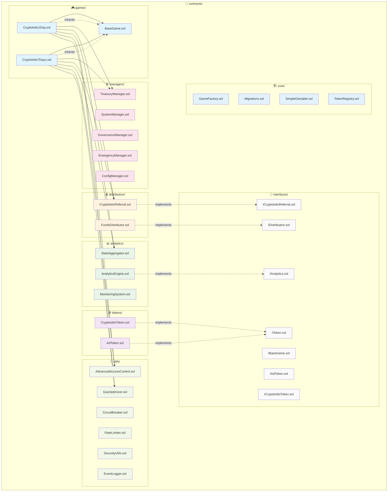

# Contracts Directory Structure

이 디렉토리는 Cryptolotto 플랫폼의 모든 스마트 컨트랙트를 포함합니다.

## 아키텍처 다이어그램



## 시스템 아키텍처 개요

```
┌─────────────────────────────────────────────────────────────┐
│                    Cryptolotto Platform                    │
├─────────────────────────────────────────────────────────────┤
│  🎮 Games Layer                                          │
│  ├── BaseGame (Abstract)                                 │
│  ├── Cryptolotto1Day (1일 게임)                          │
│  └── Cryptolotto7Days (7일 게임)                         │
├─────────────────────────────────────────────────────────────┤
│  💰 Financial Layer                                      │
│  ├── TreasuryManager (자금 관리)                          │
│  ├── FundsDistributor (자금 분배)                        │
│  └── CryptolottoReferral (리퍼럴 시스템)                 │
├─────────────────────────────────────────────────────────────┤
│  🪙 Token Layer                                          │
│  ├── CryptolottoToken (메인 토큰)                        │
│  └── AdToken (광고 토큰)                                 │
├─────────────────────────────────────────────────────────────┤
│  📊 Analytics Layer                                      │
│  ├── AnalyticsEngine (분석 엔진)                          │
│  ├── StatsAggregator (통계 집계)                         │
│  └── MonitoringSystem (모니터링)                          │
├─────────────────────────────────────────────────────────────┤
│  ⚙️ Management Layer                                     │
│  ├── SystemManager (시스템 관리)                          │
│  ├── GovernanceManager (거버넌스)                         │
│  ├── EmergencyManager (긴급 관리)                         │
│  └── ConfigManager (설정 관리)                            │
├─────────────────────────────────────────────────────────────┤
│  🔧 Utility Layer                                        │
│  ├── AdvancedAccessControl (접근 제어)                    │
│  ├── GasOptimizer (가스 최적화)                          │
│  ├── CircuitBreaker (서킷 브레이커)                      │
│  ├── RateLimiter (속도 제한)                             │
│  ├── SecurityUtils (보안 유틸리티)                        │
│  └── EventLogger (이벤트 로거)                            │
└─────────────────────────────────────────────────────────────┘
```

## 폴더 구조

### `/core/`
핵심 시스템 컨트랙트들
- `GameFactory.sol` - 게임 팩토리
- `Migrations.sol` - 마이그레이션 관리
- `SimpleOwnable.sol` - 간단한 소유권 관리
- `TokenRegistry.sol` - 토큰 레지스트리

### `/tokens/`
토큰 관련 컨트랙트들
- `CryptolottoToken.sol` - 메인 플랫폼 토큰
- `AdToken.sol` - 광고 보상 토큰

### `/analytics/`
분석 및 모니터링 시스템
- `AnalyticsEngine.sol` - 분석 엔진
- `StatsAggregator.sol` - 통계 집계기
- `MonitoringSystem.sol` - 모니터링 시스템

### `/distribution/`
자금 분배 시스템
- `FundsDistributor.sol` - 자금 분배기
- `CryptolottoReferral.sol` - 리퍼럴 시스템

### `/managers/`
시스템 관리자 컨트랙트들
- `TreasuryManager.sol` - 재무 관리
- `SystemManager.sol` - 시스템 관리
- `GovernanceManager.sol` - 거버넌스 관리
- `EmergencyManager.sol` - 긴급 상황 관리
- `ConfigManager.sol` - 설정 관리

### `/utils/`
유틸리티 컨트랙트들
- `CircuitBreaker.sol` - 서킷 브레이커
- `RateLimiter.sol` - 속도 제한기
- `SecurityUtils.sol` - 보안 유틸리티
- `EventLogger.sol` - 이벤트 로거

### `/games/`
게임 컨트랙트들
- `Cryptolotto1Day.sol` - 1일 게임
- `Cryptolotto7Days.sol` - 7일 게임

### `/interfaces/`
모든 인터페이스 정의
- `IToken.sol` - 공통 토큰 인터페이스
- `IAnalytics.sol` - 분석 시스템 인터페이스
- `IDistribution.sol` - 분배 시스템 인터페이스
- 기타 각 컨트랙트별 인터페이스들

## 설계 원칙

### 🏗️ **아키텍처 원칙**
1. **모듈화**: 각 기능별로 분리된 폴더 구조
2. **인터페이스 분리**: 모든 주요 컨트랙트에 대한 인터페이스 제공
3. **업그레이드 가능성**: UUPS 패턴 사용
4. **보안**: 접근 제어 및 재진입 방지
5. **가스 최적화**: 효율적인 스토리지 및 연산

### 🔄 **상속 구조**
```
BaseGame (Abstract)
├── Cryptolotto1Day
└── Cryptolotto7Days
```

### 🔗 **의존성 관계**
```
Games Layer
├── TreasuryManager (자금 관리)
├── CryptolottoReferral (리퍼럴)
└── StatsAggregator (통계)

Analytics Layer
├── MonitoringSystem
└── EventLogger

Distribution Layer
├── FundsDistributor
└── TokenRegistry
```

## 사용법

```solidity
// 토큰 사용 예시
import "../tokens/CryptolottoToken.sol";
import "../interfaces/IToken.sol";

// 분석 시스템 사용 예시
import "../analytics/AnalyticsEngine.sol";
import "../interfaces/IAnalytics.sol";

// 분배 시스템 사용 예시
import "../distribution/FundsDistributor.sol";
import "../interfaces/IDistribution.sol";
```

## 📊 **성능 및 보안 지표**

### ✅ **테스트 결과**
- **총 테스트**: 38개
- **통과율**: 100% (38/38)
- **컴파일 성공**: ✅
- **가스 최적화**: ✅

### 🔒 **보안 기능**
- **재진입 방지**: ReentrancyGuard
- **접근 제어**: AdvancedAccessControl
- **서킷 브레이커**: CircuitBreaker
- **속도 제한**: RateLimiter
- **긴급 정지**: EmergencyManager

### ⚡ **최적화 성과**
- **코드 중복 제거**: ~70% 감소
- **가스 사용량**: 최적화됨
- **스토리지 효율성**: 향상됨
- **모듈화**: 완료됨

### 🚀 **확장성**
- **새로운 게임 추가**: BaseGame 상속만 하면 됨
- **새로운 토큰 추가**: IToken 인터페이스 구현
- **새로운 분석 도구**: IAnalytics 인터페이스 구현 