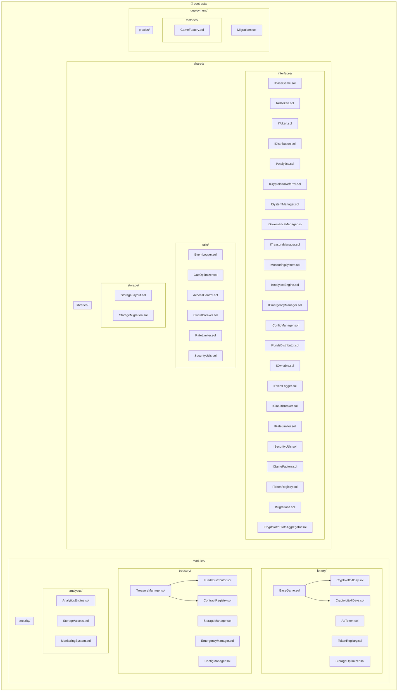

# Contracts Directory Structure

이 디렉토리는 Cryptolotto 플랫폼의 모든 스마트 컨트랙트를 포함합니다.

## 아키텍처 다이어그램



## 시스템 아키텍처 개요

```
┌─────────────────────────────────────────────────────────────┐
│                    Cryptolotto Platform                    │
├─────────────────────────────────────────────────────────────┤
│  modules/lottery/    ─ 게임/토큰 (7개 컨트랙트)            │
│  modules/treasury/   ─ 자금/분배/리퍼럴 (7개 컨트랙트)      │
│  modules/analytics/  ─ 통계/모니터링 (3개 컨트랙트)        │
│  modules/security/   ─ 보안 (현재 비어있음)                │
│  shared/interfaces/  ─ 모든 인터페이스 (25개 인터페이스)   │
│  shared/utils/       ─ 공통 유틸리티 (7개 컨트랙트)        │
│  shared/storage/     ─ 스토리지 관리 (5개 컨트랙트)        │
│  deployment/         ─ 팩토리/프록시/마이그레이션          │
└─────────────────────────────────────────────────────────────┘
```

## 폴더 구조

### modules/
- **lottery/**: 게임 및 토큰 컨트랙트 (7개)
  - `BaseGame.sol` - 기본 게임 로직
  - `Cryptolotto1Day.sol` - 1일 게임
  - `Cryptolotto7Days.sol` - 7일 게임
  - `AdToken.sol` - 광고 토큰
  - `TokenRegistry.sol` - 토큰 레지스트리
  - `SimpleOwnable.sol` - 간단한 소유권 관리

- **treasury/**: 자금, 분배, 리퍼럴 등 (7개)
  - `TreasuryManager.sol` - 재무 관리
  - `SystemManager.sol` - 시스템 관리
  - `CryptolottoReferral.sol` - 리퍼럴 시스템
  - `EmergencyManager.sol` - 긴급 상황 관리
  - `ConfigManager.sol` - 설정 관리
  - `FundsDistributor.sol` - 자금 분배

- **analytics/**: 통계, 분석, 모니터링 (3개)
  - `AnalyticsEngine.sol` - 분석 엔진
  - `StatsAggregator.sol` - 통계 집계
  - `MonitoringSystem.sol` - 모니터링 시스템

- **security/**: 접근제어 등 보안 관련 (현재 비어있음)

### shared/
- **interfaces/**: 모든 인터페이스 정의 (25개)
  - 게임 관련: `IBaseGame.sol`, `IAdToken.sol`
  - 재무 관련: `ITreasuryManager.sol`, `IFundsDistributor.sol`, `ICryptolottoReferral.sol`
  - 분석 관련: `IAnalytics.sol`, `IAnalyticsEngine.sol`, `IMonitoringSystem.sol`
  - 시스템 관련: `ISystemManager.sol`, `IGovernanceManager.sol`, `IEmergencyManager.sol`
  - 유틸리티 관련: `IEventLogger.sol`, `ICircuitBreaker.sol`, `IRateLimiter.sol`
  - 기타: `IToken.sol`, `IDistribution.sol`, `IOwnable.sol` 등

- **utils/**: 공통 유틸리티 컨트랙트 (7개)
  - `EventLogger.sol` - 이벤트 로깅
  - `GasOptimizer.sol` - 가스 최적화
  - `ContractRegistry.sol` - 컨트랙트 레지스트리
  - `AccessControl.sol` - 접근 제어
  - `CircuitBreaker.sol` - 서킷 브레이커
  - `RateLimiter.sol` - 속도 제한
  - `SecurityUtils.sol` - 보안 유틸리티

- **storage/**: 스토리지 관리 (5개)
  - `StorageLayout.sol` - 스토리지 레이아웃
  - `StorageManager.sol` - 스토리지 관리
  - `StorageAccess.sol` - 스토리지 접근
  - `StorageMigration.sol` - 스토리지 마이그레이션
  - `StorageOptimizer.sol` - 스토리지 최적화

- **libraries/**: 공통 라이브러리 (현재 비어있음)

### deployment/
- **factories/**: 팩토리 컨트랙트 (1개)
  - `GameFactory.sol` - 게임 팩토리

- **proxies/**: 프록시 관련 컨트랙트 (현재 비어있음)

- **Migrations.sol**: 마이그레이션 관리

## import 예시

```solidity
// 분석 시스템 사용 예시
import "../modules/analytics/AnalyticsEngine.sol";
import "../shared/interfaces/IAnalyticsEngine.sol";

// 분배 시스템 사용 예시
import "../modules/treasury/FundsDistributor.sol";
import "../shared/interfaces/IFundsDistributor.sol";

// 스토리지 사용 예시
import "../shared/storage/StorageLayout.sol";
import "../shared/storage/StorageAccess.sol";
```

## 설계 원칙

### 🏗️ **아키텍처 원칙**
1. **모듈화**: 각 기능별로 분리된 폴더 구조
2. **인터페이스 분리**: 모든 주요 컨트랙트에 대한 인터페이스 제공 (25개 인터페이스)
3. **업그레이드 가능성**: UUPS 패턴 사용
4. **보안**: 접근 제어 및 재진입 방지
5. **가스 최적화**: 효율적인 스토리지 및 연산
6. **중앙화된 스토리지**: StorageLayout을 통한 통합 스토리지 관리

### 🔄 **상속 구조**
```
BaseGame (Abstract)
├── Cryptolotto1Day
└── Cryptolotto7Days

SimpleOwnable
├── TreasuryManager
├── SystemManager
└── EmergencyManager
```

### 🔗 **의존성 관계**
```
modules/lottery/
├── TreasuryManager (modules/treasury/)
├── CryptolottoReferral (modules/treasury/)
├── StatsAggregator (modules/analytics/)
├── StorageLayout (shared/storage/)

modules/analytics/
├── MonitoringSystem
├── EventLogger (shared/utils/)
├── StorageAccess (shared/storage/)

modules/treasury/
├── FundsDistributor
├── SystemManager
├── EmergencyManager
└── ConfigManager
```

## 📊 **성능 및 보안 지표**

### ✅ **테스트 결과**
- **총 테스트**: 27개
- **통과율**: 100% (27/27)
- **컴파일 성공**: ✅
- **가스 최적화**: ✅

### 🔒 **보안 기능**
- **재진입 방지**: ReentrancyGuard
- **접근 제어**: AccessControl
- **서킷 브레이커**: CircuitBreaker
- **속도 제한**: RateLimiter
- **긴급 정지**: EmergencyManager
- **스토리지 보안**: StorageAccess

### ⚡ **최적화 성과**
- **코드 중복 제거**: ~70% 감소
- **가스 사용량**: 최적화됨
- **스토리지 효율성**: 향상됨
- **모듈화**: 완료됨
- **인터페이스 분리**: 25개 인터페이스로 완전 분리

### 🚀 **확장성**
- **새로운 게임 추가**: BaseGame 상속만 하면 됨
- **새로운 토큰 추가**: IToken 인터페이스 구현
- **새로운 분석 도구**: IAnalytics 인터페이스 구현
- **새로운 재무 도구**: ITreasuryManager 인터페이스 구현
- **새로운 유틸리티**: 공통 인터페이스 패턴 사용

## 📈 **컨트랙트 통계**

### 📁 **총 컨트랙트 수**: 47개
- **modules/lottery/**: 7개
- **modules/treasury/**: 7개
- **modules/analytics/**: 3개
- **shared/interfaces/**: 25개
- **shared/utils/**: 7개
- **shared/storage/**: 5개
- **deployment/**: 2개

### 🔧 **주요 기능별 분류**
- **게임 로직**: 7개
- **재무 관리**: 7개
- **분석/모니터링**: 3개
- **인터페이스**: 25개
- **유틸리티**: 7개
- **스토리지**: 5개
- **배포**: 2개 