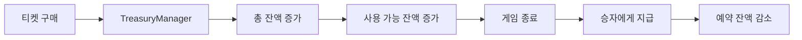
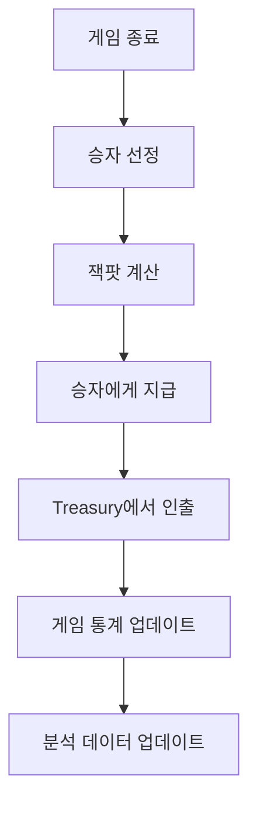

# Cryptolotto Treasury System

## 🏦 시스템 개요

Cryptolotto Treasury System은 플랫폼의 모든 자금을 중앙화된 방식으로 관리하는 시스템입니다. 이 시스템은 투명성, 보안성, 효율성을 핵심 가치로 하며, 다양한 재무 기능을 통합 관리합니다.

## 🏗️ 아키텍처 구조

```
┌─────────────────────────────────────────────────────────────┐
│                    Treasury System                         │
├─────────────────────────────────────────────────────────────┤
│  TreasuryManager.sol    ─ 중앙화된 자금 관리               │
│  SystemManager.sol      ─ 전체 시스템 통합 관리             │
│  FundsDistributor.sol   ─ 개발자 수수료 수집               │
│  CryptolottoReferral.sol ─ 단순화된 리퍼럴 시스템         │
│  EmergencyManager.sol   ─ 긴급 상황 관리                   │
│  ConfigManager.sol      ─ 설정 관리 시스템                 │
└─────────────────────────────────────────────────────────────┘
```

## 💰 자금 관리 시스템

### 1. **TreasuryManager - 중앙화된 자금 관리**

#### 📊 **Treasury 구조**
```solidity
struct Treasury {
    uint256 totalBalance;      // 총 잔액
    uint256 reservedBalance;   // 예약된 잔액
    uint256 availableBalance;  // 사용 가능한 잔액
    uint256 lastUpdate;        // 마지막 업데이트 시간
    bool isActive;             // 활성 상태
}
```

#### 🔄 **자금 흐름**


#### 📋 **주요 기능**
- **다중 Treasury 지원**: 여러 게임별 Treasury 관리
- **자동 잔액 계산**: 총 잔액, 예약 잔액, 사용 가능 잔액 자동 계산
- **인출 한도 관리**: 최대 인출 금액 설정 및 관리
- **최소 보유량 비율**: 시스템 안정성을 위한 최소 보유량 설정

### 2. **FundsDistributor - 개발자 수수료 수집**

#### 💸 **새로운 수수료 구조 (총 10%)**
```
티켓 가격: 0.01 ETH
├── 90% → 잭팟 (승자에게 지급)
├── 2% → 리퍼럴 보상 (CryptolottoReferral)
├── 3% → Ad Lottery 수수료 (CryptolottoAd)
└── 5% → 개발자 수수료 (FundsDistributor)
```

#### 🔄 **개발자 수수료 처리**
```solidity
// BaseGame에서 개발자 수수료 전송
function _processDeveloperFee(uint256 amount) internal virtual {
    (bool success, ) = payable(distributorAddress).call{value: amount}("");
    if (success) {
        emit DeveloperFeeSent(distributorAddress, amount, block.timestamp);
    }
}

// FundsDistributor에서 수수료 수신
receive() external payable {
    if (msg.value > 0) {
        emit CommissionReceived(msg.value, block.timestamp);
    }
}

// 개발자 수수료 인출
function withdrawFunds() public onlyOwner nonReentrant whenNotPaused {
    uint amount = address(this).balance;
    (bool success, ) = payable(owner).call{value: amount}("");
    emit FundsWithdrawn(owner, amount, block.timestamp);
}
```

## 🤝 단순화된 리퍼럴 시스템 (CryptolottoReferral)

### 1. **즉시 리퍼럴 보상 시스템**

#### 📊 **리퍼럴 구조**
```
사용자 티켓 구매 → 리퍼러 주소 전달 → 즉시 보상 지급 (2%)
```

#### 💰 **보상 구조**
- **기본 보상 비율**: 2% (조정 가능, 최대 20%)
- **즉시 지급**: 티켓 구매 시 즉시 리퍼러에게 보상 지급
- **통계 추적**: 리퍼러별 총 리퍼럴 수, 총 보상 금액 추적

#### 🔗 **단순화된 사용법**
```solidity
// 티켓 구매 시 리퍼럴 주소 전달
function buyTicket(address referrer, uint256 ticketCount) public payable {
    // 티켓 구매 로직
    // ...
    
    // 수수료 분배 처리
    _processFeeDistribution(msg.value, referrer);
}

// BaseGame에서 수수료 분배
function _processFeeDistribution(uint256 ticketAmount, address referrer) internal {
    uint256 totalFee = (ticketAmount * 10) / 100;        // 10%
    uint256 referralFee = (ticketAmount * 2) / 100;      // 2%
    uint256 adLotteryFee = (ticketAmount * 3) / 100;     // 3%
    uint256 developerFee = (ticketAmount * 5) / 100;     // 5%
    
    // 리퍼럴 보상 처리
    if (referrer != address(0) && referralFee > 0) {
        _processReferralReward(referrer, referralFee);
    }
    
    // Ad Lottery 수수료 처리
    if (adLotteryFee > 0) {
        _processAdLotteryFee(adLotteryFee);
    }
    
    // 개발자 수수료 처리
    if (developerFee > 0) {
        _processDeveloperFee(developerFee);
    }
}

// 리퍼럴 보상 처리
function _processReferralReward(address referrer, uint256 amount) internal virtual {
    CryptolottoReferral(referralAddress).processReferralReward{value: amount}(referrer, amount);
}

// Ad Lottery 수수료 처리
function _processAdLotteryFee(uint256 amount) internal virtual {
    if (amount > 0) {
        // Ad Lottery 수수료는 Ad Lottery 게임의 당첨금으로 사용
        emit AdLotteryFeeCollected(amount, block.timestamp);
    }
}
```

#### 📈 **리퍼럴 통계**
```solidity
struct ReferralStats {
    uint256 totalReferrals;    // 총 리퍼럴 수
    uint256 totalRewards;      // 총 보상 금액
    uint256 lastRewardTime;    // 마지막 보상 시간
}

// 리퍼러 통계 조회
function getReferralStats(address referrer) external view returns (
    uint256 totalReferrals,
    uint256 totalRewards,
    uint256 lastRewardTime
) {
    ReferralStats storage stats = referralStats[referrer];
    return (stats.totalReferrals, stats.totalRewards, stats.lastRewardTime);
}
```

#### ⚙️ **관리 기능**
```solidity
// 보상 비율 설정 (최대 20%)
function setReferralRewardPercent(uint256 newPercent) external onlyOwner {
    require(newPercent <= 20, "Reward percent cannot exceed 20%");
    referralRewardPercent = newPercent;
    emit ReferralRewardPercentUpdated(oldPercent, newPercent, block.timestamp);
}

// 컨트랙트 잔액 인출
function withdrawContractBalance() external onlyOwner {
    uint256 balance = address(this).balance;
    require(balance > 0, "No balance to withdraw");
    (bool success, ) = payable(owner).call{value: balance}("");
    require(success, "Withdrawal failed");
}
```

## 🎯 Ad Lottery 수수료 시스템

### 1. **Ad Lottery 수수료 구조**

#### 📊 **수수료 흐름**
```
1Day/7Days 게임 → 3% 수수료 수집 → Ad Lottery 잭팟에 추가
```

#### 💰 **Ad Lottery 잭팟 구성**
```
Ad Lottery 티켓: 1 AD Token
├── 100% → 잭팟 (승자에게 지급)
└── 추가: 1Day/7Days에서 수집된 3% 수수료
```

#### 🔄 **수수료 처리 과정**
```solidity
// 1Day/7Days 게임에서 Ad Lottery 수수료 수집
function _processAdLotteryFee(uint256 amount) internal virtual {
    if (amount > 0) {
        // Ad Lottery 수수료는 Ad Lottery 게임의 당첨금으로 사용
        emit AdLotteryFeeCollected(amount, block.timestamp);
    }
}

// Ad Lottery에서 수수료를 잭팟에 추가
function _processAdLotteryFee() internal {
    // 1day와 7day 게임의 수수료 3%를 Ad Lottery 잭팟에 추가
    uint256 adLotteryPrize = 0.1 ether; // 임시 값
    
    if (adLotteryPrize > 0) {
        // Ad Lottery 잭팟에 추가
        StorageLayout.GameStorage storage gameStorage = getGameStorage();
        uint256 currentGameId = gameStorage.totalGames > 0
            ? gameStorage.totalGames - 1
            : 0;
        StorageLayout.Game storage game = gameStorage.games[currentGameId];
        game.jackpot += adLotteryPrize;
    }
}
```

## 🚨 긴급 상황 관리 (EmergencyManager)

### 1. **긴급 정지 시스템**

#### 🔴 **긴급 정지 기능**
```solidity
// 긴급 정지
function emergencyPause() external onlyOwner {
    emergencyPaused = true;
    emit EmergencyPaused(msg.sender, block.timestamp);
}

// 긴급 정지 해제
function emergencyResume() external onlyOwner {
    emergencyPaused = false;
    emit EmergencyResumed(msg.sender, block.timestamp);
}
```

#### 🛡️ **보안 기능**
- **전체 시스템 긴급 정지**: 모든 컨트랙트 동시 정지
- **선택적 컨트랙트 정지**: 특정 컨트랙트만 정지
- **자동 복구 시스템**: 정지 해제 후 자동 복구

### 2. **컨트랙트 등록 시스템**
```solidity
// 컨트랙트 등록
mapping(address => bool) public registeredContracts;
address[] public allContracts;

function registerContract(address contractAddress) external onlyOwner {
    registeredContracts[contractAddress] = true;
    allContracts.push(contractAddress);
}
```

## ⚙️ 설정 관리 (ConfigManager)

### 1. **게임 설정 관리**

#### 🎮 **게임 설정 구조**
```solidity
struct GameConfig {
    uint ticketPrice;           // 티켓 가격
    uint gameDuration;          // 게임 지속 시간
    uint8 fee;                  // 수수료 비율
    uint maxTicketsPerPlayer;   // 최대 티켓 수
    bool isActive;              // 활성 상태
}
```

#### 📊 **기본 설정**
```solidity
// 1일 게임 설정
gameConfigs[4] = GameConfig({
    ticketPrice: 0.02 ether,
    gameDuration: 86400,        // 1일
    fee: 10,                    // 10%
    maxTicketsPerPlayer: 100,
    isActive: true
});

// 7일 게임 설정
gameConfigs[5] = GameConfig({
    ticketPrice: 1 ether,
    gameDuration: 604800,       // 7일
    fee: 10,                    // 10%
    maxTicketsPerPlayer: 50,
    isActive: true
});

// Ad Lottery 게임 설정
gameConfigs[6] = GameConfig({
    ticketPrice: 1 * (10 ** 18), // 1 AD Token
    gameDuration: 86400,        // 1일
    fee: 0,                     // 수수료 없음
    maxTicketsPerPlayer: 100,
    isActive: true
});
```

### 2. **시스템 파라미터 관리**
```solidity
// 시스템 파라미터
systemParams["minTicketPrice"] = 0.01 ether;
systemParams["maxTicketPrice"] = 10 ether;
systemParams["minGameDuration"] = 3600;      // 1시간
systemParams["maxGameDuration"] = 2592000;   // 30일
```

## 🔧 시스템 통합 관리 (SystemManager)

### 1. **통합 시스템 구조**

#### 🔗 **컨트랙트 연결**
```solidity
// 핵심 시스템 컨트랙트
IEmergencyManager public emergencyManager;
IConfigManager public configManager;
ITokenRegistry public tokenRegistry;
ISecurityUtils public securityUtils;
IMonitoringSystem public monitoringSystem;
IEventLogger public eventLogger;
IAnalyticsEngine public analyticsEngine;
IRateLimiter public rateLimiter;
ICircuitBreaker public circuitBreaker;
ITreasuryManager public treasuryManager;
```

#### 🔄 **시스템 상태 관리**
```solidity
// 시스템 상태
bool public systemActive;
uint256 public lastSystemCheck;

// 시스템 초기화
function initialize(
    address owner,
    address _emergencyManager,
    address _configManager,
    // ... 기타 컨트랙트 주소들
) public initializer {
    __Ownable_init(owner);
    // 모든 컨트랙트 연결
}
```

### 2. **시스템 모니터링**
```solidity
// 시스템 상태 확인
function performSystemCheck() external onlyOwner {
    bool isHealthy = _checkSystemHealth();
    lastSystemCheck = block.timestamp;
    emit SystemCheckPerformed(block.timestamp, isHealthy);
}

// 보안 알림
function triggerSecurityAlert(address user, string memory reason) external {
    emit SecurityAlertTriggered(user, reason, block.timestamp);
}
```

## 📊 자금 분배 프로세스

### 1. **티켓 구매 시 자금 분배**
```mermaid
graph TD
    A[사용자 티켓 구매] --> B[0.01 ETH 전송]
    B --> C[TreasuryManager]
    C --> D[총 잔액 증가]
    D --> E[사용 가능 잔액 증가]
    E --> F[게임 잭팟에 추가]
    F --> G[수수료 분배 (10%)]
    G --> H[리퍼럴 보상 (2%)]
    G --> I[Ad Lottery 수수료 (3%)]
    G --> J[개발자 수수료 (5%)]
```

### 2. **Ad Lottery 티켓 구매 시 자금 분배**
```mermaid
graph TD
    A[사용자 Ad Token 티켓 구매] --> B[1 AD Token 전송]
    B --> C[Ad Lottery 잭팟에 추가]
    C --> D[고정 수수료 추가 (0.1 ETH)]
    D --> E[Ad Lottery 게임 진행]
```

### 3. **게임 종료 시 자금 분배**


## 🔒 보안 기능

### 1. **재진입 방지**
```solidity
import "@openzeppelin/contracts/utils/ReentrancyGuard.sol";

contract TreasuryManager is Ownable, ReentrancyGuard {
    function withdrawFunds() external nonReentrant {
        // 재진입 공격 방지
    }
}
```

### 2. **접근 제어**
```solidity
// 소유자만 실행 가능
modifier onlyOwner() {
    require(msg.sender == owner, "Only owner can call this function");
    _;
}

// 권한 있는 컨트랙트만 실행 가능
modifier onlyAuthorizedContract() {
    require(authorizedContracts[msg.sender], "Not authorized");
    _;
}
```

### 3. **입력 검증**
```solidity
// 금액 검증
modifier onlyValidAmount(uint256 amount) {
    require(amount > 0, "Amount must be greater than 0");
    require(amount <= 10000 ether, "Amount exceeds maximum limit");
    _;
}

// 사용자 주소 검증
modifier onlyValidUser(address user) {
    require(user != address(0), "Invalid user address");
    _;
}
```

## 📈 이벤트 시스템

### 1. **Treasury 이벤트**
```solidity
event TreasuryCreated(
    string indexed treasuryName,
    uint256 initialBalance,
    uint256 timestamp
);
event FundsDeposited(
    string indexed treasuryName,
    address indexed user,
    uint256 amount,
    uint256 timestamp
);
event FundsWithdrawn(
    string indexed treasuryName,
    address indexed user,
    uint256 amount,
    uint256 timestamp
);
```

### 2. **수수료 분배 이벤트**
```solidity
// BaseGame
event FeeDistributed(
    address indexed referrer,
    uint256 referralFee,
    uint256 adLotteryFee,
    uint256 developerFee,
    uint256 totalFee,
    uint256 timestamp
);

event DeveloperFeeSent(
    address indexed developer,
    uint256 amount,
    uint256 timestamp
);

event AdLotteryFeeCollected(
    uint256 amount,
    uint256 timestamp
);

// CryptolottoReferral
event ReferralRewardPaid(
    address indexed referrer,
    address indexed player,
    uint256 amount,
    uint256 timestamp
);

event ReferralStatsUpdated(
    address indexed referrer,
    uint256 totalReferrals,
    uint256 totalRewards,
    uint256 timestamp
);

event ReferralRewardPercentUpdated(
    uint256 oldPercent,
    uint256 newPercent,
    uint256 timestamp
);

// FundsDistributor
event CommissionReceived(uint amount, uint time);
event FundsWithdrawn(address to, uint amount, uint timestamp);
```

### 3. **긴급 상황 이벤트**
```solidity
event EmergencyPaused(address indexed by, uint timestamp);
event EmergencyResumed(address indexed by, uint timestamp);
event SecurityAlertTriggered(
    address indexed user,
    string reason,
    uint256 timestamp
);
```

## ⚡ 가스 최적화

### 1. **배치 처리**
```solidity
// 여러 Treasury 동시 업데이트
function updateMultipleTreasuries(
    string[] memory treasuryNames,
    uint256[] memory amounts
) external onlyOwner {
    for (uint i = 0; i < treasuryNames.length; i++) {
        _updateTreasury(treasuryNames[i], amounts[i]);
    }
}
```

### 2. **스토리지 최적화**
- 중앙화된 스토리지 사용
- 불필요한 상태 변수 제거
- 효율적인 매핑 구조 사용

### 3. **이벤트 최적화**
- 중요한 이벤트만 발생
- 인덱싱된 이벤트 사용
- 가스 효율적인 이벤트 구조

## 🚀 확장성

### 1. **새로운 Treasury 추가**
```solidity
// 새로운 게임용 Treasury 생성
function createTreasury(string memory treasuryName, uint256 initialBalance) external onlyOwner {
    treasuries[treasuryName] = Treasury({
        totalBalance: initialBalance,
        reservedBalance: 0,
        availableBalance: initialBalance,
        lastUpdate: block.timestamp,
        isActive: true
    });
}
```

### 2. **새로운 수수료 구조 추가**
```solidity
// 새로운 수수료 분배 규칙 추가
function addFeeDistribution(
    string memory gameType,
    uint256[] memory percentages
) external onlyOwner {
    // 새로운 수수료 분배 규칙 설정
}
```

## 🎯 새로운 수수료 분배 시스템의 장점

### 1. **명확한 수수료 구조**
- **총 수수료**: 10% (투명하고 예측 가능)
- **리퍼럴 보상**: 2% (즉시 지급)
- **Ad Lottery 수수료**: 3% (Ad Lottery 게임 지원)
- **개발자 수수료**: 5% (지속적인 개발 지원)

### 2. **모듈화된 설계**
- **BaseGame**: 수수료 분배 조정자 역할
- **CryptolottoReferral**: 리퍼럴 보상 전담 처리
- **CryptolottoAd**: Ad Lottery 수수료 수집 및 게임 운영
- **FundsDistributor**: 개발자 수수료 수집 및 관리

### 3. **즉시 보상 시스템**
- **리퍼럴 보상**: 티켓 구매 시 즉시 리퍼러에게 지급
- **Ad Lottery 수수료**: 1Day/7Days에서 수집하여 Ad Lottery 잭팟에 추가
- **통계 추적**: 리퍼러별 상세 통계 제공
- **유연한 설정**: 보상 비율을 0-20% 범위에서 조정 가능

### 4. **Ad Lottery 통합**
- **1Day/7Days 게임**: Ad Lottery 수수료 3% 수집
- **Ad Lottery 게임**: 수집된 수수료를 잭팟에 추가
- **Ad Token 활용**: 광고 시청 보상으로 Ad Lottery 참여
- **이중 보상**: Ad Token + 1Day/7Days 수수료

### 5. **개발자 친화적**
- **간단한 통합**: `buyTicket(referrerAddress, ticketCount)` 형태로 사용
- **즉시 테스트**: 등록 과정 없이 바로 테스트 가능
- **명확한 API**: 복잡한 파트너 관리 시스템 제거

---

**마지막 업데이트**: 2024년 12월
**버전**: 1.1.0
**라이선스**: MIT 