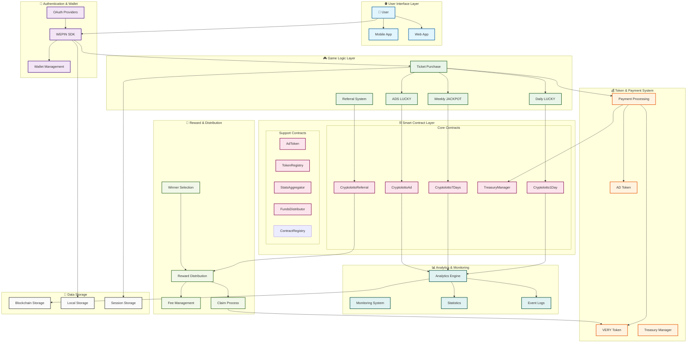
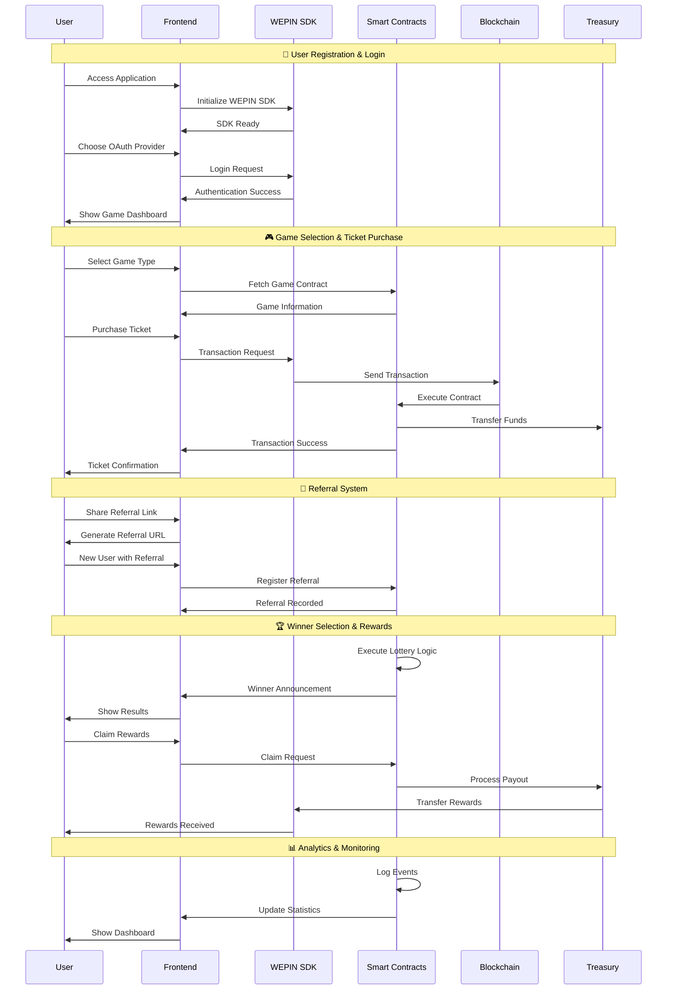
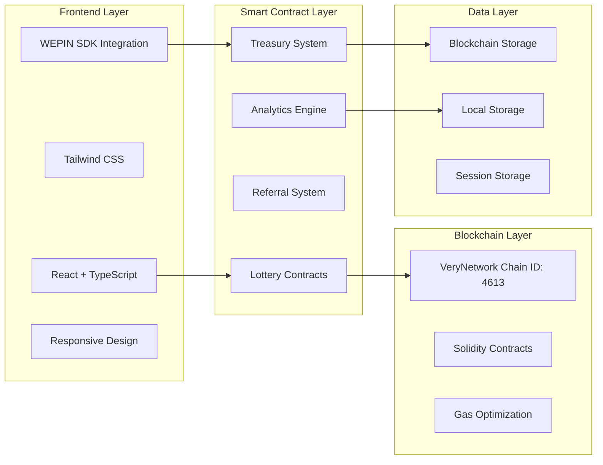
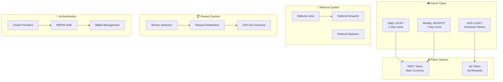
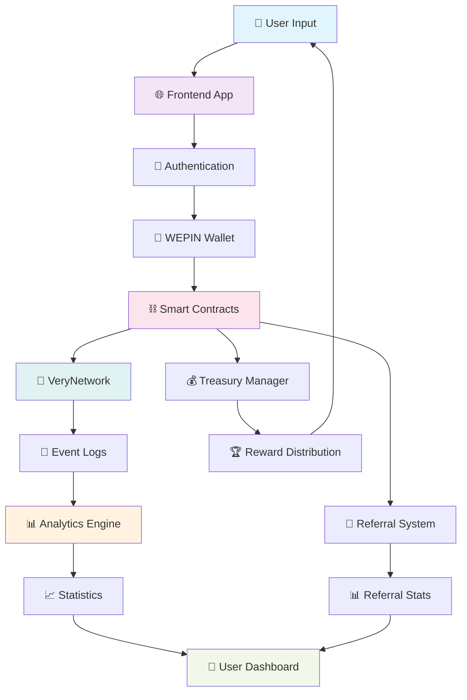
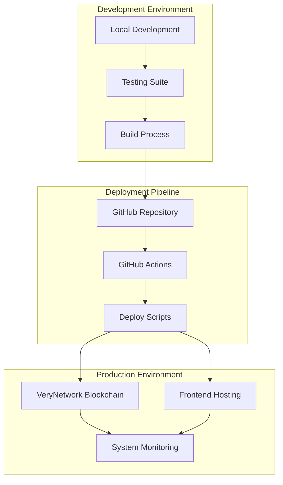

# ETH-Lottery Project Complete System Diagram

## 🔄 **Complete System Flow Diagram**

## 🔄 **Detailed User Journey Flow**

## 🏗️ **System Architecture Overview**

## 🎯 **Core Components Breakdown**

## 📊 **Data Flow Architecture**

## 🚀 **Deployment & Infrastructure**

---

**💡 To convert these diagrams to images:**
1. Copy the mermaid code blocks
2. Use online Mermaid editors like:
   - [Mermaid Live Editor](https://mermaid.live/)
   - [Mermaid Chart](https://www.mermaidchart.com/)
3. Export as PNG, SVG, or PDF
4. Or use GitHub's built-in Mermaid rendering in markdown files
